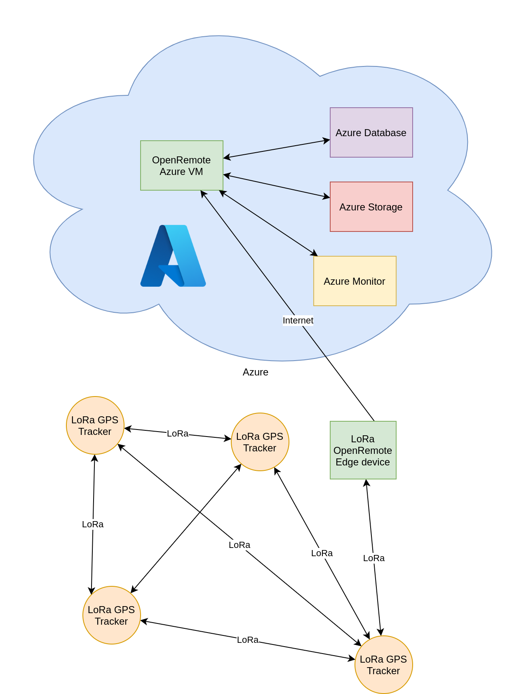

# Wacky IoT: OpenRemote LoRa GPS Trackers

OpenRemote has asked us to connect a "wacky" IoT device to their IoT platform. 
After some brainstorming we came up with our concept: a GPS tracker which works via long-range radio (a.k.a. LoRa) technology. 
The GPS trackers communicate over LoRa in a mesh network and send their locations via an edge device to the cloud-hosted OpenRemote platform.

## Case

In our project, we focussed around the use case for large sports events, such as large bike events across the country. While the system itself has been made generic and can be adapted to other use cases, a lot of design elements were influenced by our case. This means some of the decisions made may not make sense for your unique application.

## Results

While a "wacky" use-case for LoRa technology, we were able to make the system function as designed. 
Using LoRa technology for the GPS tracker mesh network helps devices stay connected even at long ranges, while being battery efficient.

## Architecture

Our GPS trackers use a custom protocol on top of the LoRa PHY (physical layer) to communiciate inside of a mesh network. The edge device, a Raspberry Pi, is also present in this mesh network and will be sent GPS updates from the trackers. The edge device in turn can put the received updates into OpenRemote, which can then sync them with a cloud-hosted OpenRemote installation.

## GPS Tracker firmware

The firmware ran on our GPS trackers which make them obtain their location and transmit packets over LoRa.

**Code**: [tracker_firmware/](tracker_firmware/)

**Docs**: [GPS Tracker Docs](docs/tracker.md)

## RFM95 LoRa driver/OpenRemote interface

User-space driver for the RFM95 LoRa module & TCP interface for OpenRemote.

**Code**: [lora_driver/](lora_driver/)

**Docs**: [LoRa Modem driver](docs/lora_driver.md)

## LoRa protocol

Because we based our system on the LoRa PHY (physical layer), we needed to define ourself an application layer to use to transmit our data. We devised a format for encoding messages which is also capable of handling other types of messages, not just our GPS tracker messages

**Docs**: [Protocol docs](./docs/protocol.md)

## OpenRemote fork w/ LoRa agent

Fork of OpenRemote which includes a new LoRaAgent type.
The LoRaAgent will connect with the LoRa driver/interface to configure the LoRa module & receive messages.

**Code**: [OpenRemote fork](https://github.com/Raqbit/openremote/)

**Docs**: [Protocol Agent](./docs/protocol_agent.md)

## OpenRemote location groovy rule

Custom OpenRemote rule which takes the GPS location from the attribute bound to the LoRaAgent and updates the asset's location.

**Code**: [Groovy rule](https://github.com/Raqbit/openremote/blob/radio-protocol/test/src/main/resources/org/openremote/test/rules/TestRule.groovy)
