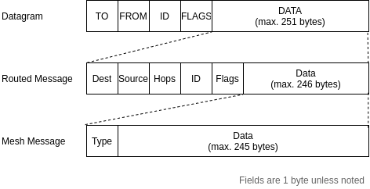

# Edge Device Lora Modem Driver Daemon

## Introduction

One of the goals of the GPS tracker Mesh project is to use OpenRemote’s edge gateway software on a local Raspberry Pi as an edge node in our LoRa radio mesh network. This means OpenRemote will have to be able to receive messages sent by the trackers using a LoRa modem connected to the Raspberry Pi. 

A couple of problems arise when looking at options on connecting OpenRemote on the Raspberry Pi to a LoRa modem: 

First, the LoRa modem we chose is connected via the Serial Peripheral Interface (SPI) protocol1 and requires a driver to function, something which is not included by Linux and thus needs to be running in user-space.2 Creating such a driver would be a project itself and thus we should look for existing driver software. 

Second, LoRa is by itself unstructured and complex. It is just a physical layer for long-range radio communication and does have a “link layer” for addressing and routing (“MAC addressing” in a traditional ethernet/wifi network), a “transport layer”, which handles reliability and connections (“TCP”, “UDP”, etc. in a traditional internet network) or the “application layer”, which defines the format of messages (“HTTPS”, “NTP”, “DNS”, etc. in a traditional internet network).  

OpenRemote however, prefers structured data which has a certain state to it, like a lightbulb which is on or off, or a thermometer with a measured temperature. This means we can’t just ‘hook up’ the LoRa modem to OpenRemote and we will need to define an abstraction layer on top of LoRa which is usable by others who might want to try this out. 

The goal of this document is to explain our solutions to these problems and how we are planning on making OpenRemote be able to receive messages via the LoRa modem.

## Finding a LoRa Driver 

Our Raspberry Pi is going to use an RFM95 module6 based on the SX1276 LoRa transceiver modem chip to receive data from the LoRa mesh network. Normally the SX1276 is driven with a microcontroller which is running a software library, called RadioHead8, which provides an API written in C to communicate with the modem. Using RadioHead, one can easily send data packets using LoRa without having to know how the underlying SPI protocol works. RadioHead also provides routing & link layers, which allow you to give nodes in the network addresses so data packets can be directed to a specific node. 

On the Raspberry Pi however, RadioHead cannot be used as the library is made to target microcontrollers with raw access to hardware peripherals, which the Raspberry Pi is not. We did find someone who tried to modify RadioHead for it to be able to work with the Linux APIs for hardware access on the Raspberry Pi, but when testing we concluded that the library was not stable enough for our project. 

When looking for other suitable pieces of driver software, we came across a driver for the RFM9X modules made for CircuitPython. CircuitPython is a project by Adafruit which contains a Python runtime for microcontrollers, allowing you to write Python code for popular microcontrollers.  

Luckily for us, CircuitPython is very modular and even has a compatibility layer, called Blinka, which allows code written for CircuitPython to be used on Raspberry Pi devices! After installing this compatibility layer, the CircuitPython library was working as intended and we could reliably send and receive LoRa messages from Python code.

## Adding the link & routing layers 

Even though we now had a driver which would allow us to communicate with the LoRa modem, we were still missing pieces to allow messages from the GPS trackers to be received correctly by the edge device. Mainly, we were missing the link & routing layers.

The link layer is responsible for addressing, to make it possible to send messages to a specific device. Each device in the network should get its own address, much like MAC addresses in an ethernet network. Because this address is unique within the network, any data packets sent with this address mentioned should only be handled by the device with that address. While this does not guarantee data privacy as the data packets are still being transmitted over the air and a malicious device could easily detect & read these messages, it does mean that compliant devices will know if a data packet is meant for them. 

The routing layer is responsible for making it possible to route specific messages via other devices. If device A wants to send data packets to device C without being in range, device A can transmit data packets which device B receives and then re-transmits to device C. 

On the GPS trackers, the link & routing layers are handled by the RadioHead library are using. Through the RHDatagram class, RadioHead adds support for addressing nodes (devices) with an 8-bit identifier, which it sends in a header before sending the data payload of the packet. Devices which receive these data packets can extract the destination ID from this header to detect if the message was meant for them or if they should ignore it.  

The RHReliableDatagram class16 extends further on this concept by adding acknowledgements to the system, where devices should respond to the sender when they have received a message. This way the sender will know when a message was lost in the aether and thus needs to be re-transmitted. 

To add routing to the system, RadioHead has an RHRouter class. RHRouter adds another header to every packet sent which contain the original sender & destination of the packet. Because of this, receivers of the packet will know if they are the destination or if they should re-transmit the packet to another device to make the packet reach its destination. To tell the system how the route these packets, the RHRouter class allows programming a Routing Table. 

To implement the link & routing layers in our CircuitPython driver, we only needed to add code for the RHRouter message header, which was easily done after reading into the RHRouter class.

## Mesh compatibility
The last part of the RadioHead compatibility we needed to implement was support for the mesh system. RadioHead implements mesh networking via the RHMesh class. RHMesh builds on top of RHRouter by adding automatic route discovery. If no route to the destination device is present in the RHRouter routing table, RHMesh will broadcast a discovery request. All receivers of this broadcast will check if they are being requested, and if not, add their own address to the discovery request & re-broadcast it. When the discovery request reaches the destination, it will send a response back to the originator, using the chain of addresses it found in the discovery request.

Using this novel system, devices can discover routes to each other in the network and thus build their own routing table without any pre-configured information. When a device does not get an acknowledgement from a device used in the routing chain, the device will be marked as “dead”, and the chain will be deleted from the routing tables of all devices in the chain. The original sender will notice this as well and try to re-discover a route to the destination device so it can re-transmit the data packet.

Implementing this system in the CircuitPython driver required implementing the discovery request/response protocol, in order to allow devices to discover the route to the edge device. Fortunately for us we did not have to implement route discovery ourselves, because the edge device will not be sending any messages, just receiving them.

## Making it usable by OpenRemote
At this point we have a fully functioning driver, which can receive incoming messages from GPS trackers in the mesh network & decode them. The last piece of the puzzle is to make it possible for an OpenRemote protocol implementation to use this driver.

As OpenRemote is written in Java, this Python driver code can sadly not simply be included into the OpenRemote codebase. The option that remains is to make the LoRa modem driver a separate application and allow an OpenRemote protocol to communicate with it.

To make this possible, we are looking at allowing OpenRemote to send JSON over a TCP connection to the driver, which will run in the background as a deamon1. OpenRemote will be able to configure the driver by setting connection parameters like the edge device’s mesh network address. A custom protocol will expose these parameters as protocol configuration options just like most other protocols available in OpenRemote.

Linking assets should also work similarly to other protocols, except that the asset values will be the latest received message by a specific node address encoded in JSON, and the user will have to configure some decoding in order to get the raw values out of the message. Because this is already the case for some other supported protocols like raw TCP, this should not be an issue.

## Message Encoding
To decode the messages received via the LoRa mesh network into Python data structures, we have developed a custom encoding format. We made sure that this format is generic in the sense that any message can be decoded, not just our GPS update messages.

This encoding format is described in full detail by [protocol.md](./protocol.md).