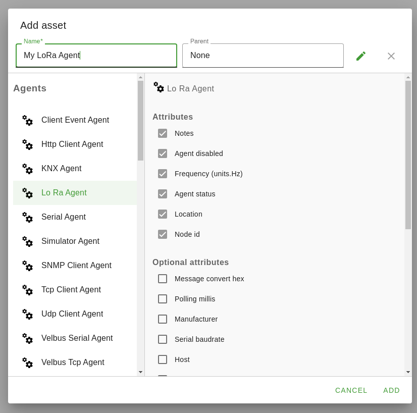
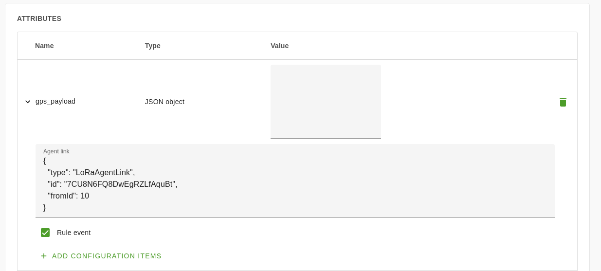

# LoRa OpenRemote Protocol Agent

## Introduction
In the “Edge Device LoRa Modem Driver Daemon” document we described how we are making it possible for OpenRemote to interface with the LoRa modem through a piece of driver software we are making. Even though this driver software handles most of the LoRa-side of the communication, we still need to modify OpenRemote to be able to make it interact with this driver software.

In this document we will describe how the user will be able to configure LoRa support in OpenRemote, how OpenRemote will communicate with the LoRa modem driver to configure these options and receive messages from the LoRa mesh network via the LoRa modem driver and finally how this is implemented architecturally inside the OpenRemote Java application.

## Setting up the code

Because the LoRa Protocol Agent is bundled with a fork of OpenRemote, the normal [OpenRemote development set-up guide](https://github.com/openremote/openremote/wiki/Developer-Guide%3A-Setting-up-an-IDE) applies.

## Agent Setup 

The first step in setting up a protocol in OpenRemote is creating an agent for the protocol. This is an object inside OpenRemote which creates the connection to another program or device via the given protocol, in our case via the LoRa driver. To create a LoRa agent in OpenRemote, the user opens the manager interface of OpenRemote and creates a new asset of type “LoRa Agent.” 



To make the LoRa protocol easy to use, most of the attribute options have good defaults which worked best for us. The user can, however, configure some of the options, like the radio frequency and the node ID for the edge device. The radio frequency is important to change, as it should be set to the correct frequency of the LoRa modem that is being used. LoRa can operate in various sub-gigahertz frequency bands, like 443Mhz, 868Mhz and 915Mhz.  To figure out which type of LoRa transceiver to buy, one should look up their national frequency spectrum map. In the Netherlands, the 915Mhz band is not open to the public and therefore, the 868Mhz band is most used as the alternative with the highest possible bitrate. 

The node ID is the unique identifier of the edge device, comparable to an IP address in an IP network. All other LoRa nodes should use this node ID to send messages to the edge device and the LoRa modem driver will only detect messages sent for this Node ID. 

After creating the Radio agent in OpenRemote, it will start connecting to the LoRa modem driver. When it successfully connected, which should not take long because of the local connection, the agent should get a “connected” status, highlighting that the connection to the LoRa modem driver was successful.

## Linking attributes to an agent

Next, the user can link attributes of other assets within OpenRemote to this agent via an Agent Link. At the time of writing, setting up agent links in the new OpenRemote user interface is sadly not possible yet and thus we will need to create a small piece of JSON in order to configure it. 
For every attribute linked to an agent, the user can configure for which node ID it should listen. This way you can add multiple agent links for multiple devices, or multiple GPS trackers in our case. After creating the agent link, any message received by the LoRa modem will be routed to the correct agent link(s) via the sender’s Node ID.

In the example shown in the picture below, any message received from LoRa (tracker) node 10 will be sen tto the gps_payload attribute shown.



## Driver handshake

Behind the scenes, the LoRa protocol agent in OpenRemote went through various steps in order to configure and set up the LoRa modem correctly via the user’s configured settings. The Agent will connect to the TCP server ran by the daemon and send messages back and forth.

Each “message” is defined as a utf-8 encoded JSON string, delimited by a newline, which can either be a carriage return & line-feed (\r\n) or just a line-feed (\n). Each JSON object must also have a “type” field, which denotes the type of the JSON message and is used to differentiate between them. The various types that are used for communication are:

|||
|-|-|
|`HANDSHAKE`|Tells the OpenRemote protocol agent that it can configure the LoRa modem driver.|
|`CONFIGURE`|Message used to configure the LoRa modem driver.|
|`CONFIGURE_OK`|Tells OpenRemote that the LoRa modem driver has been configured and that it will start receiving messages.|
|`RECEIVED_MESSAGE`|Tells OpenRemote that a new LoRa message has been received.|

The first message is sent by the modem driver daemon, to acknowledge that the connection was successful. This message has a type of “HANDSHAKE” and does not contain any further data apart from the message type:

```json
{"type": "HANDSHAKE"}
```

Next, the OpenRemote agent will respond to the handshake message by giving the driver the settings that the user configured for the LoRa Agent by sending a "CONFIGURE” message:


```json
{"type": "CONFIGURE", "frequency": 868, "nodeId": 0}
```

The LoRa modem daemon will now use these settings to initialize the LoRa modem into the right frequency and to set the correct Node ID to use for listening for incoming messages. 
Once the LoRa modem driver daemon is done configuring, it will respond with a “CONFIGURE_OK” message, which signals to the OpenRemote agent protocol that configuring is done.

```json
{"type": "CONFIGURE_OK"}
```

Now, whenever the LoRa modem driver receives any data packets from the LoRa mesh network that it can decode, it will send a message to the OpenRemote agent protocol containing the sender’s node ID & the data they sent, which has already been decoded & re-encoded into JSON:

```json
{
    "type":"RECEIVED_MESSAGE",
    "from":3,
    "data": {
        "dt":1618481901,
        "lt":51.75491472544241,
        "lg":5.89499349575653,
        "sp":30.3,
        "al":200.4,
        "cs":30.6
    }
}
```

## Security

In the system, when run as intended, the LoRa modem driver & the OpenRemote edge device will be running on the same system. Therefore, we decided not to build in any kind of transport security into the protocol used for communication between the components. The LoRa modem driver is setup to only listen for incoming connections on the localhost interface, meaning anyone with malicious intent will need to be on the local system to be able to connect to the LoRa modem driver.